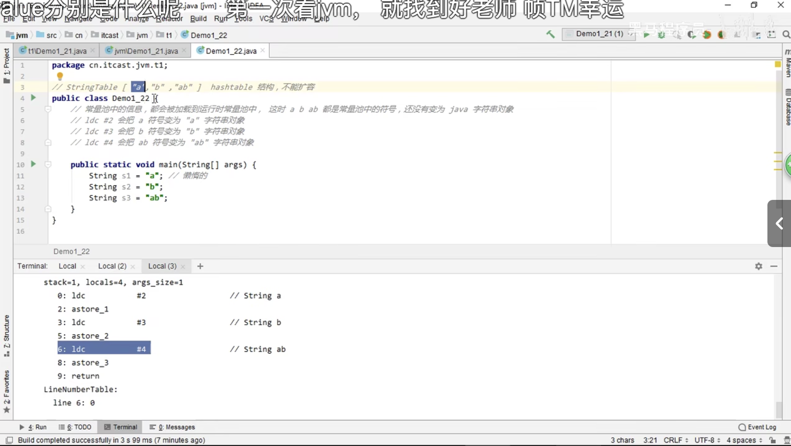

programme counter register 程序计数器

程序计数器（寄存器）

- 是记住下一条jvm指令的执行地址
- 特点
  - 是线程私有的
  - 不会存在内存溢出

 

虚拟机栈是线程私有的，但堆是线程共享的，堆中的对象都要考虑线程安全的问题，另外，堆具有垃圾回收机制，通过new关键字，创建的对象都会使用堆内存

栈 -Xss 堆 -Xmx

jmap -heap xxxx

jvitualvm

字节码技术

- spring
- mybatis

javap -v xxx.class

