 四种隔离级别：读未提交，读已提交，可重复读，序列化读

### 1.DDL-数据定义语言

#### DDL-数据库和表操作

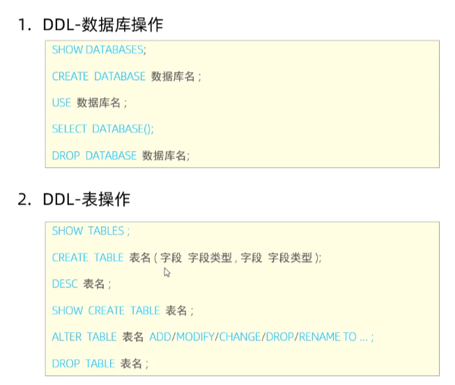

#### DDL-表操作-新增

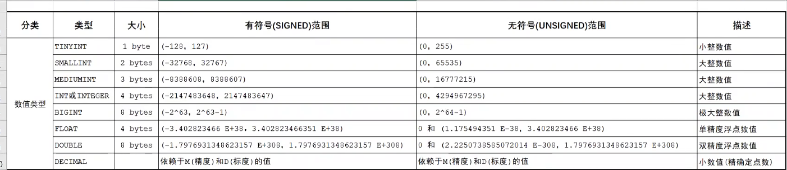

varchar变长字符串，char的性能高，varchar会根据内容去计算字符串长度，用户名的长度用varchar会更好，性别使用char更好，因为只占一个字符长度；

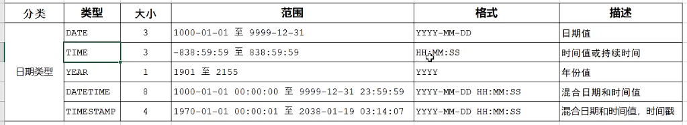

生日date更好

##### 创建员工表

```sql
create table emp(
    id int comment '编号',
    workno varchar(10) comment '工号', 
    name varchar(10) comment '姓名',
    gender char(1) comment '性别',
    age tinyint unsigned comment '年龄',
    idcard char(18) comment '身份证号',
    entrydate date comment '入职时间'
) comment '员工表';
```

#### DDL-表操作-修改

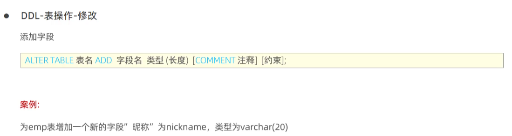

```sql
alter table emp add nickname varchar(10) comment '昵称';
```

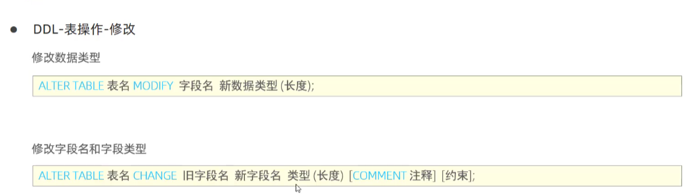

```sql
alter table emp change nickname username varchar(30) comment '昵称';
```

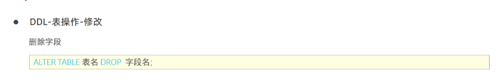

```sql
alter table emp drop username;
```

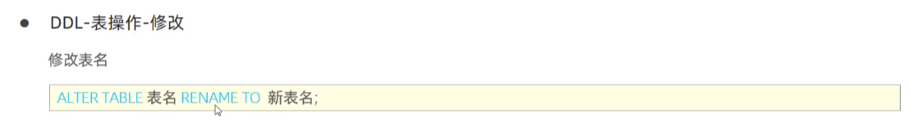

```sql
alter table emp rename to employee;
```

alter table add/modify/change/drop/rename to

#### DDL-表操作-删除

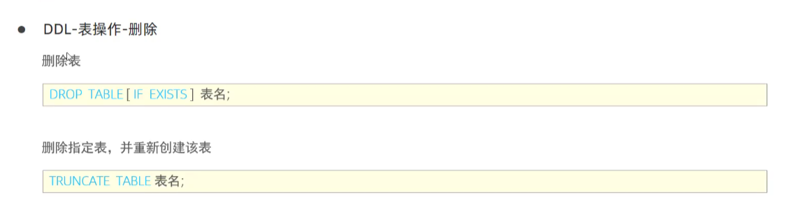

```sql
drop table if exists employer;
```

### 2.DML-数据操作语言

#### DML-数据操作-添加

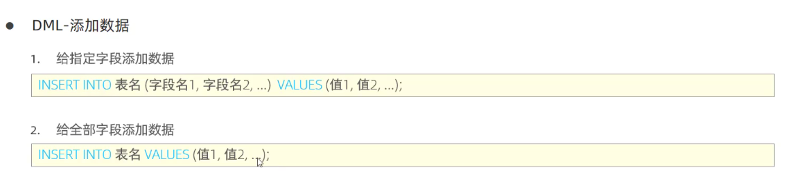

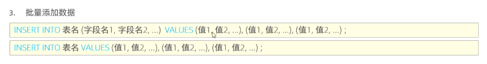


```sql
insert into user(id,name) values(21,'asd')
insert into user values(25,'asavd'), (22,'aasdsd')
```

unsigned无法传入负值

#### DML-数据操作-修改

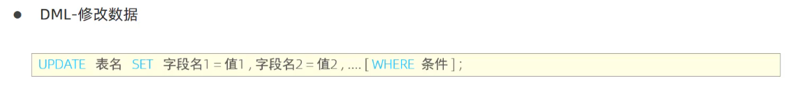

```sql
update employee set name = 'yjy' where id = 1;
```

#### DML-数据操作-删除

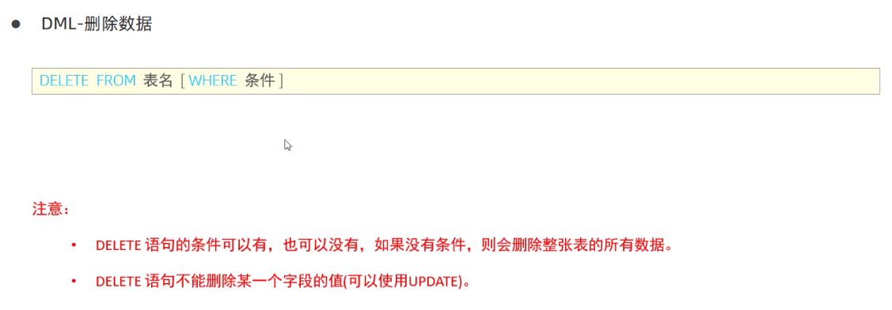

```sql
select from emp where gender = "女";
```

### 3.DQL-数据查询语言

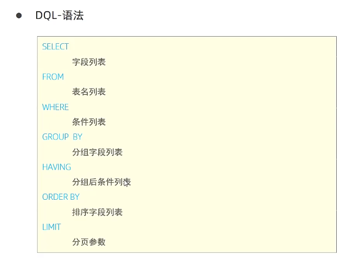

#### DQL-数据查询-基本查询

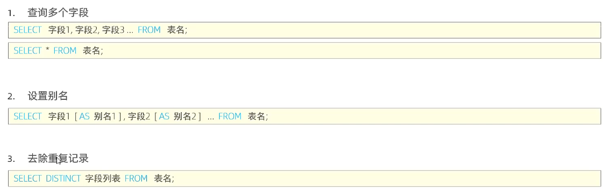

```sql
select distinct workaddress as '居住地' from emp;
```

